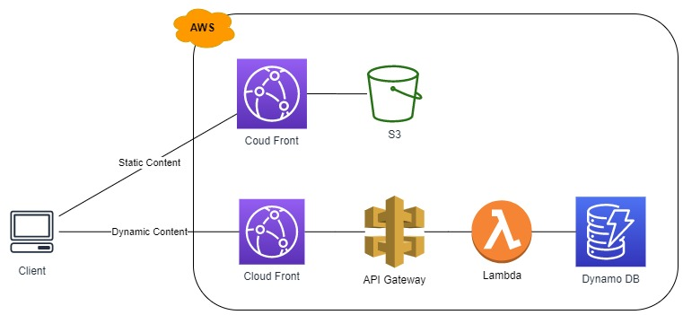
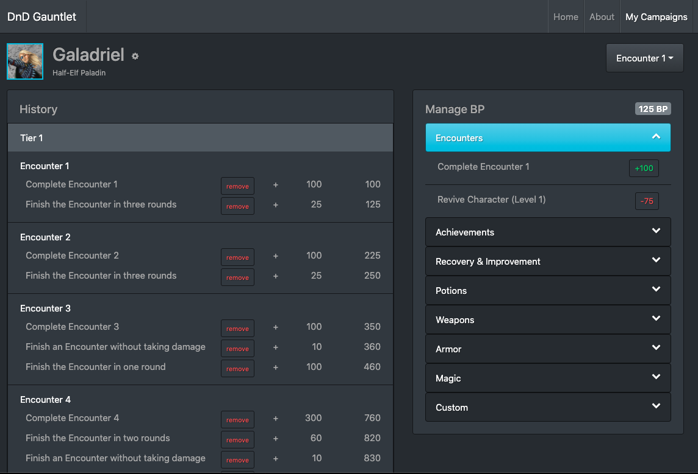

# gauntlet-bp-tracker
A simple web application for running DnD Campaigns.

## Motivation
Inspired by the excellent 5th Edition Dungeons and Dragons content [Masters of the Gauntlet](https://www.spectrecreations.com/#MotG) by TheArenaGuy, this site provides an easy to use online interface for tracking Battle Points - a unique system to that module. With the rise of online DnD campaigns and excellent tools like [DnDBeyond](https://www.dndbeyond.com/), [Roll20](https://roll20.net/) and many others, I wanted to make something easy to use to collaborate my players.

The Gauntlet module uses provides a streamlined set of rules that focuses on a series of increasingly difficult combat encounters. This allows for fast, fun campaigns that are perfect for new players or for veterans wanting to experiment with new characters and playstyles. Instead of receiving typical currency or item rewards, characters receive points after each encounter which they can spend on equipment and upgrades. This site allows players and to track the points they have earned and spent. It also allows the Dungeon Master to view their activity, and even customize the reward system for the campaign.

## Overview

### Front End
The front end is an SPA written in TypeScript 3.7 and React 16, scaffolded using the [create-react-app](https://github.com/facebook/create-react-app) package.  It utilizes Bootstap v4 and FontAwesome v4 for CSS and graphic frameworks.

The front end is hosted on an AWS S3 bucket and distributed by CloudFront.

#### Choice of React for UI Framework
I have used React for a few projects now, and find it's unidirectional data flow and focus on composition preferable to Angular's MVC architecture.
React's popularity and robust ecosystem remain positive factors, with many resources and libraries available to leverage.

I'd used [Redux](https://redux.js.org/) for a past project, and found that, while powerful, it felt cumbersome to work with and I felt I was writing a lot of boiler plate code.  
This project provided an opportunity to try the new the new stateful functional components and the [hooks](https://reactjs.org/docs/hooks-intro.html) APIs as a replacement.

##### Lessons Learned
Overall, I found that for a project this size, Redux is unnecessary and the new features accelerated my development.
There are still situations where retaining a global data store would be preferable, however I'm satisfied with the existing architecture for now.

#### Character Page
The primary feature of the app is the character page, which allows players to track points earned and spent during the game.

This page is populated based on two separate documents:
- Character purchase history
- Campaign settings (point rewards and costs, etc.)

These documents are merged by a service class, which transforms and maintains the domain model that is rendered.  user activity is then able to be transmitted asyncronously to the server.  The data transfers are managed by a Container component.

##### Lessons Learned
Creating a dedicated service class to manage state was well worth the investment, as it provided the flexibility to develop and test the user interface without dependencies on the back end.
After the API was scaffolded, the service provided an easy point to hook in the server transactions with existing logic.

### Back End
The back end is a web socket API that calls Lambda methods with data stored in a DynamoDB document database.  All Lambda methods are written in TypeScript 3.7.  The API endpoints are defined by a [SAM](https://aws.amazon.com/serverless/sam/) document.

#### Use of Typescript
##### Tradeoffs / Decisions made
#### Use of SAM
##### Tradeoffs / Decisions made
#### Websocket API
##### Tradeoffs / Decisions made
#### No Authentication Requirement
##### Tradeoffs / Decisions made
#### Use of DynamoDb vs RDBMS
##### Tradeoffs / Decisions made
#### Lessons Learned

### CI/CD

The project's development pipeline was generated using a [CDK](https://aws.amazon.com/cdk/) template, which uses CodePipeline, CodeBuild, and CloudFormation to trigger build, test, and deploy actions. 

#### Use of CDK vs SAM / CloudFormation
##### Tradeoffs / Decisions made
#### No Authentication Requirement
##### Tradeoffs / Decisions made
#### Lessons Learned

## TODO / Future Features
