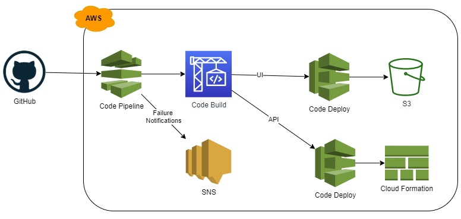

# gauntlet-bp-tracker
A simple web application for running DnD Campaigns.

## Motivation
Inspired by the excellent 5th Edition Dungeons and Dragons content [Masters of the Gauntlet](https://www.spectrecreations.com/#MotG) by TheArenaGuy, this site provides an easy to use online interface for tracking Battle Points - a unique system to that module. With the rise of online DnD campaigns and excellent tools like [DnDBeyond](https://www.dndbeyond.com/), [Roll20](https://roll20.net/) and many others, I wanted to make something easy to use to collaborate my players.

The Gauntlet module uses provides a streamlined set of rules that focuses on a series of increasingly difficult combat encounters. This allows for fast, fun campaigns that are perfect for new players or for veterans wanting to experiment with new characters and playstyles. Instead of receiving typical currency or item rewards, characters receive points after each encounter which they can spend on equipment and upgrades. This site allows players and to track the points they have earned and spent. It also allows the Dungeon Master to view their activity, and even customize the reward system for the campaign.

## Overview


### Front End
The front end is an SPA written in TypeScript 3.7 and React 16, scaffolded using the [create-react-app](https://github.com/facebook/create-react-app) package.  It utilizes Bootstap v4 and FontAwesome v4 for CSS and graphic frameworks.
It is hosted on an AWS S3 bucket and distributed by CloudFront.

#### Choice of React for UI Framework
I have used React for a few projects now, and find it's unidirectional data flow and focus on composition preferable to Angular's MVC architecture.
React's popularity and robust ecosystem remain positive factors, with many resources and libraries available to leverage.

I'd used [Redux](https://redux.js.org/) for a past project, and found that, while powerful, it felt cumbersome to work with and I felt I was writing a lot of boilerplate code.  
This project provided an opportunity to try the new the new stateful functional components and the [hooks](https://reactjs.org/docs/hooks-intro.html) APIs as a replacement.

##### Lessons Learned
Overall, I found that for a project this size, Redux is unnecessary and the new features accelerated my development.
There are still situations where retaining a global data store would be preferable, however I'm satisfied with the existing architecture for now.

#### Character Page
The primary feature of the app is the character page, which allows players to track points earned and spent during the game.


This page is populated based on two separate documents:
- Character purchase history
- Campaign settings (point rewards and costs, etc.)

These documents are merged by a service class, which transforms and maintains the domain model that is rendered.  user activity is then able to be transmitted asyncronously to the server.  The data transfers are managed by a Container component.

##### Lessons Learned
Creating a dedicated service class to manage state was well worth the investment, as it provided the flexibility to develop and test the user interface without dependencies on the back end.
After the API was scaffolded, the service provided an easy point to hook in the server transactions with existing logic.

### Back End
The back end is a web socket API that calls Lambda methods with data stored in a DynamoDB document database.  
All Lambda methods are written in TypeScript 3.7.  
The API endpoints are defined by a [SAM](https://aws.amazon.com/serverless/sam/) document.

#### Use of SAM
I chose to use the [SAM Framework](https://aws.amazon.com/serverless/sam/) for this project, an extension of CloudFormation that retains the YAML format but abstracts away much of the complexity.
Having worked with [CloudFormation](https://aws.amazon.com/cloudformation/) direclty in the past, I found it quite difficult to work with.  
Creating even a simple stack required hundreds of lines of YAML - definitions of each object, their relationship to others, creation of roles and permissions to bind them, etc.
I was interested to see how well the SAM Framework would simplify the process for this project.

##### Lessons Learned
While SAM did effectively reduce the amount of YAML code I needed to write, I still found the SAM framework cumbersome.
Each API endpoint required ~40 lines of code to represent, with lots of duplication of properties and settings.
I also ran into limitations where SAM builds would fail due to resources that could be created, but not updated or deleted.
I worked around these limitations by splitting off these resources to separate SAM templates (e.g. database tables and S3 buckets).

I also ran into a quirk of the SAM framework where newly added API endpoints would build, and render as part of the API in the AWS Console, but would be unavailable on the API itself.
I tracked this to a setting on the API Stage object:

```YAML
  Stage:
    Type: AWS::ApiGatewayV2::Stage
    Properties:
      AutoDeploy: true # default value: false
```
With this setting set to its default value, changes to an API definition will not be applied to an existing Stage, only newly created ones.
This makes a lot of sense for Production APIs for ensuring backwards compatibility (eg. `/api/v1/{endpoint}`).
However, the behaviour of completing the build successfully without issuing a warning that changes would not be applied meant a number of hours spent debugging to find and altering the above setting.
Once this was applied, development pace was increased dramatically.

Ultimately, while I found SAM to be an improvement over directly using CloudFormation I am not excited to use it in my next project.  I'm more inclined to use the [CDK Framework](https://docs.aws.amazon.com/cdk/latest/guide/home.html) instead, or look for other options.

#### Websocket API
One of the key features I wanted to include in this project was a notification system.
This would allow the DM and easily see player activity, and allow players to see each others'.
Supporting this on an REST API would require frequent polling of an endpoint, but would be easily accommodated by a WebSocket API.
And, since I had never used websockets before I thought this would be great project to give them a try.

##### Lessons Learned
AWS provides a great [variation](https://docs.aws.amazon.com/apigateway/latest/developerguide/apigateway-websocket-api.html) on their API Gateway product that supports websockets.
However, it is constrained by not being able to be integrated into an existing REST style API Gateway instance.
Due to that limitation, I implemented ALL endpoints for this project using the same websocket API.

This is not a choice I would make again.
Subscribing to, listening for, and then unsubscribing to an event type just to handle a single round trip to the server (such as updating a character's name) was unnecessarily complicated on the client side.
In my next project, I would instead spin up two API Gateway instances: a REST API to handle the majority of traffic, and a websocket API to handle bidirectional data.

### CI/CD



The project's development pipeline was generated using a [CDK](https://aws.amazon.com/cdk/) template, which uses [CodePipeline](https://aws.amazon.com/codepipeline/), [CodeBuild](https://aws.amazon.com/codebuild/), and [CloudFormation](https://aws.amazon.com/cloudformation/) to trigger builds and deploy changes.

The pipeline is hooked into this GitHub repository via an OAuth secured webhook.  Builds are triggered on push to the Staging and Production branches.

#### Use of CDK
I found that CDK was more comfortable than SAM for managing templates.  
The ability create my own data structures made replicating and parameterizing the build process for Production and Staging much simpler than my experience of SAM.

For future projects I expect I will be leaning more on the CDK framework than SAM for managing infrastructure.
That said, the Pipeline right now acts as scaffold for building two SAM stacks - building out an equivalently complicated stack as done for the API may involve just as much boilerplate in CDK as it does in SAM.

## TODO / Future Features
- A set of cron jobs for gathering usage analytics
- A simplified workflow for creating characters and campaigns via import from [DndBeyond](https://www.dndbeyond.com)
- Expanded customizations for campaign settings
